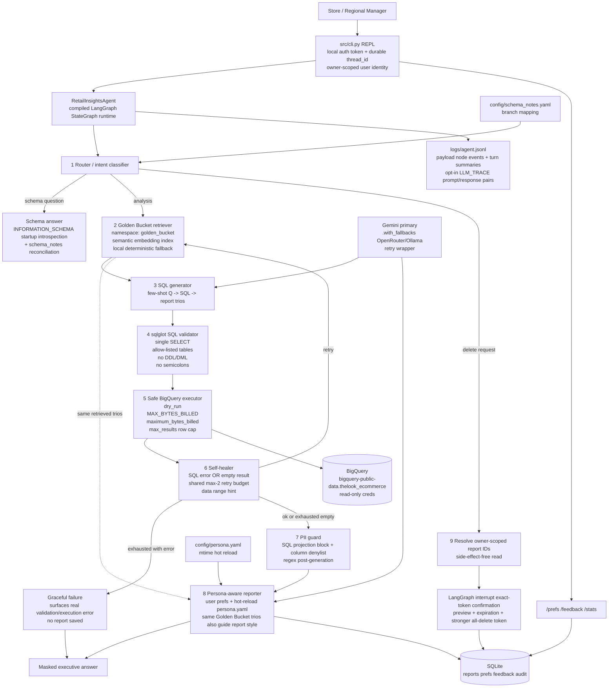

# Governed Text-to-SQL Agent

A governed natural-language analytics agent over `bigquery-public-data.thelook_ecommerce`. Non-technical managers ask business questions in plain language; the agent classifies intent, grounds SQL generation with a Golden Bucket of prior analyst Question→SQL→Report trios, validates every query through layered guardrails, masks PII deterministically, manages saved reports with owner-scoped destructive-operation oversight, self-heals bounded SQL failures, and emits structured JSONL telemetry.

It is a reference implementation of the governance patterns I apply in client analytics and agent work, built entirely on public data so every control is inspectable end to end. An **N8N automation workflow** (`retail_insights_agent_n8n_production.json`, diagram in `n8n_workflow.png`) wraps the agent for event-driven and scheduled operation.

The repository is local-first: no mandatory external services beyond BigQuery for real data runs, and Docker is optional. Local smoke tests use a deterministic stub LLM and mock BigQuery runner so anyone can run the repo immediately, either natively (below) or via the included `Dockerfile`/`docker-compose.yml`.

## Architecture



The full high-level design — technology-choice reasoning, data flow, error handling and fallback strategy, observability, and a requirement-by-requirement walkthrough — is in [docs/HLD.md](docs/HLD.md). The requirement-to-implementation map is in [docs/COMPLIANCE_MATRIX.md](docs/COMPLIANCE_MATRIX.md).

## Quick start

```bash
python -m venv .venv
source .venv/bin/activate
pip install -r requirements.txt
cp .env.example .env
python -m pytest -q
python evaluation/run_evals.py
python -m src.cli --user-id demo_manager --auth-token demo-token
```

Expected local checks:

```text
94 passed
Pass rate: 10/10 = 100%
```

## Docker (optional)

Docker is not required (the Quick start above needs only Python), but a `Dockerfile` and
`docker-compose.yml` are included for a fully containerized run. Both
paths run the identical stub-LLM/mock-BigQuery smoke tests — no GCP or Gemini credentials
needed:

```bash
cp .env.example .env
docker compose run --rm tests
docker compose run --rm evals-mock
docker compose run --rm agent
```

`agent` starts the interactive CLI inside the container. If you change source and re-run,
add `--build` (e.g. `docker compose run --rm --build tests`) since `run` reuses an existing
image for that service instead of rebuilding automatically.

For a live BigQuery + Gemini run in Docker, set `GCP_KEY_HOST_PATH` in `.env` to your service
account key's path on the host, fill in `GOOGLE_CLOUD_PROJECT` and `GEMINI_API_KEY`, then:

```bash
docker compose run --rm agent
docker compose run --rm evals   # --mode live
```

The `agent`/`evals` services mount that key read-only into the container and override
`GOOGLE_APPLICATION_CREDENTIALS`, `USE_STUB_LLM=false`, and `USE_MOCK_BQ=false` automatically.

## Real BigQuery / Gemini mode

Edit `.env`:

```bash
USE_STUB_LLM=false
USE_MOCK_BQ=false
GOOGLE_CLOUD_PROJECT=your-gcp-project-id
GOOGLE_APPLICATION_CREDENTIALS=/absolute/path/to/read-only-service-account.json
GEMINI_API_KEY=...
GEMINI_MODEL_NAME=gemini-3.5-flash
MAX_BYTES_BILLED=200000000
MAX_ROWS_RETURNED=100
```

The model name is intentionally read from `GEMINI_MODEL_NAME`; Gemini model names change, so do not bury a model string in application logic.

Free-tier quota note: AI Studio free keys have small daily generate quotas per model
(observed: ~20/day for `gemini-3.5-flash`, far higher for `gemini-3.1-flash-lite`) and a
separate embedding quota. When the embedding quota runs out, the agent degrades gracefully:
Golden Bucket retrieval falls back to a deterministic local index (logged as
`golden_bucket: degraded`) and the session keeps working. When the generate quota runs out
mid-turn, the turn fails with a controlled error and the CLI stays alive. For a full
`evaluation/run_evals.py --mode live` pass, prefer `gemini-3.1-flash-lite` as
`GEMINI_MODEL_NAME` or a paid-tier key. To record the resolved LangGraph version after installation:

```bash
python - <<'PY'
import langgraph
print(langgraph.__version__ if hasattr(langgraph, "__version__") else langgraph)
PY
```

## CLI authentication

The CLI no longer treats `--user-id` as proof of identity. Each local user must provide a token from `config/users.yaml` or an environment variable referenced by that file. This is still a local prototype substitute for SSO/IAM, but it prevents simple user impersonation such as `--user-id victim_manager` without a matching token.

```bash
python -m src.cli --user-id demo_manager --auth-token demo-token
# or
RETAIL_INSIGHTS_USER_TOKEN=demo-token python -m src.cli --user-id demo_manager
```

Production swap: issue `user_id` from the authenticated enterprise session rather than accepting it as a free CLI argument.

## CLI commands

```text
/help                         show commands
/schema                       show live startup schema introspection
/prefs format=bullets         set manager-level formatting preference
/prefs format=table tone=plain
/feedback good "useful report" persist feedback for Golden Bucket promotion
/stats                        aggregate logs/agent.jsonl
/exit                         quit
```

`/stats` reports agent-level metrics: turn counts and outcomes (`ok`, `graceful_failure`,
`runtime_error`, `refused`, ...), turn error rate, average and p95 turn latency, real
self-heal retries, node error counts, and per-node event counts. For deep-dive debugging,
every JSONL event carries `thread_id`/`turn_id`, so one grep reconstructs a whole turn:
the question, resolved intent, generated SQL, validation verdict, row counts, masked report
preview, and outcome. Set `LLM_TRACE=true` in `.env` to additionally log PII-masked
prompt/response previews for every LLM call.

### Persona (tone) management without redeploy

`config/persona.yaml` is editable by non-developers and hot-reloads on file change —
the next report picks up the new tone without restarting the CLI. Resolution order is:
explicit per-user `/prefs` values > `persona.yaml` > built-in defaults, so a personal
preference wins for that user, while everyone else follows the persona file. A broken or
non-mapping YAML edit never fails a turn: the last good persona stays in effect and a
`persona_loader: reload_failed` event with the parse error is written to `logs/agent.jsonl`.

After local token validation, the CLI uses a stable per-user `thread_id` (`retail-insights:<user-id>`) and persists LangGraph checkpoints to the same local SQLite database through `SqliteSaver` when installed. Pending delete confirmations and the last turn used by `/feedback` are also stored in SQLite, so a classic CLI process restart does not erase active confirmation state. Use `--new-thread` to intentionally start fresh.

## Worked examples

```text
manager> Who are our top 10 customers by total spend?
Business takeaway (concise_executive):
- user_id: 101, total_spend: 1022.5, orders: 12
- user_id: 202, total_spend: 980.0, orders: 10
```

```text
manager> Why is the Texas branch underperforming compared to California?
This dataset is from an online retailer with no physical branches — I'm reading 'branch' as the customers' state. Tell me if you meant distribution centers instead.

Business takeaway (concise_executive):
- state: California, revenue: 250000.0, orders: 1800, return_rate: 0.06
- state: Texas, revenue: 190000.0, orders: 1600, return_rate: 0.11
```

```text
manager> Show me a customer's email for order #12345
I cannot reveal customer email, phone, address, or other PII. Requested PII fields are [REDACTED] and are not projected in SQL output; the analysis below is redacted before reporting.

Business takeaway (concise_executive):
- order_id: 12345, user_id: 123, total_spend: 99.0
```

```text
manager> Delete all reports mentioning Acme Corp
Matched 2 owner-scoped report(s). Preview: [...]
Type exactly `CONFIRM DELETE` to delete. Any other reply cancels. This expires automatically.
manager> yes
Cancelled. Nothing was deleted. Exact token required: CONFIRM DELETE
```

## Repository layout

```text
config/persona.yaml           hot-reloadable tone/persona config
config/schema_notes.yaml      curated schema notes and branch mapping
data/golden_bucket/           15 seed Question -> SQL -> Analyst Report trios
src/agent/                    LangGraph StateGraph node orchestration
src/database/                 safe BigQuery runner and SQLite report store
src/knowledge/                Golden Bucket embedding/search and promotion script
src/security/                 PII masking and sqlglot SQL validation
src/observability/            JSONL telemetry and /stats aggregation
evaluation/                   golden cases and execution-based eval runner
tests/                        unit + integration tests
docs/HLD.md                   architecture, data flow, and requirement walkthrough
docs/COMPLIANCE_MATRIX.md     requirement-to-implementation map
docs/MANAGER_GUIDE.md         plain-language user guide for non-technical managers
```

## Design notes worth checking

PII protection starts at SQL generation and validation, not only in Python masking. The SQL generator is instructed never to project `email|phone|street_address|postal_code`; `sql_guardrails.py` rejects SELECT projections containing those PII/quasi-PII columns and also rejects wildcard projections such as `SELECT *` / `SELECT u.*` so raw PII columns cannot be materialized accidentally. BigQuery rows are still deterministically masked immediately after materialization, before rows can be serialized into any reporter prompt. A regex safety net also masks free text and final prose.

SQL safety is layered. Every generated SQL string is parsed with `sqlglot`, must be exactly one SELECT, must not contain semicolons, must avoid DDL/DML, must not project PII columns or wildcard row projections, and may only reference the allow-listed `thelook_ecommerce` tables. The BigQuery runner then dry-runs, checks `MAX_BYTES_BILLED`, sets server-side `maximum_bytes_billed`, and caps materialized rows with `max_results`.

The branch/store/region ambiguity is handled explicitly. Because the dataset is online retail and has no physical branch column, ambiguous branch questions default to `users.state`; distribution-center questions use `distribution_centers` via `products.distribution_center_id`.

Saved-report deletion is owner-scoped in the SQL update itself. Confirmation is exact-token, previewed, expiring, and stronger for all-reports deletes.

## Golden Bucket promotion

```bash
python -m src.knowledge.promote_trio <feedback_id> --reviewed
```

The script refuses unsafe placeholders unless `--allow-draft` is used. With `--reviewed`, it writes the promoted YAML and rebuilds the Golden Bucket index, preventing silent Golden Bucket poisoning while satisfying the CLI-only promotion workflow.

## N8N automation workflow

The agent can run headless behind an N8N workflow for event-driven or scheduled analytics
(`retail_insights_agent_n8n_production.json`; visual overview in `n8n_workflow.png`). The
workflow handles trigger, request shaping, the agent call over its API boundary, structured-output
parsing, and downstream delivery, so the same governed pipeline that runs in the CLI can be
operated as an automation without changing the safety controls.

## Optional tracing

Local telemetry is always written to `logs/agent.jsonl`. If LangSmith is configured, LangChain/LangGraph automatic tracing can also be enabled with:

```bash
LANGCHAIN_TRACING_V2=true
LANGCHAIN_API_KEY=...
```

## Final spec-coherence verification

After installing dependencies, run the strict runtime check before trusting the LangGraph path:

```bash
python scripts/verify_runtime.py
```

Then run the local deterministic proof suite:

```bash
USE_STUB_LLM=true USE_MOCK_BQ=true python -m pytest -q
USE_STUB_LLM=true USE_MOCK_BQ=true python evaluation/run_evals.py --mode mock
```

The mock eval is intentionally isolated from the network. It validates orchestration, guardrails, masking, confirmation, telemetry, and evaluation plumbing. Live text-to-SQL correctness is validated separately with:

```bash
python evaluation/run_evals.py --mode live --refresh-cache
python evaluation/run_evals.py --mode live
```


