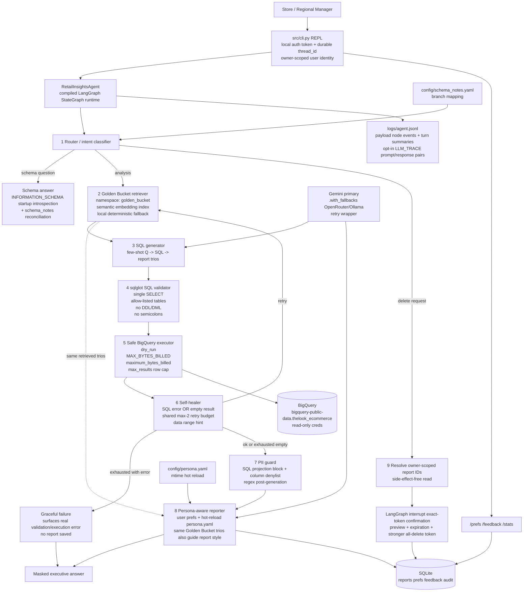

# High-Level Design — Retail Insights Agent

## Architecture diagram

## Mission fit

The system is a CLI chat agent for non-technical Store and Regional Managers. It uses BigQuery as the only mandatory external service for real data runs; all other prototype state lives in local files or SQLite. The repo is runnable two ways: natively via `pip install -r requirements.txt` and one `.env` file (no Docker required), or fully containerized via the included `Dockerfile`/`docker-compose.yml` for anyone who prefers not to manage a local Python environment. Docker is optional, not a requirement.

## Technology choices

| Layer | Prototype choice | Reason | Production swap |
|---|---|---|---|
| LLM | `ChatGoogleGenerativeAI` configured by `GEMINI_MODEL_NAME`; stub model for CI | Gemini is the required primary path, but the model string is not hardcoded in business logic | Vertex AI Gemini endpoint for enterprise quota/SLA |
| Fallbacks | LangChain `.with_fallbacks()` to Gemini fallback, OpenRouter, then Ollama when configured | Keeps the CLI alive during provider failures; local fallback is optional | Provider policy router with per-session health state |
| Golden Bucket | YAML trios seeded once into a LangGraph `InMemoryStore` namespace with Gemini embeddings as the real primary path and deterministic CI fallback | First-party LangGraph memory semantics without extra services | `PostgresStore` later with same namespace semantics |
| State/orchestration | `build_langgraph()` compiled `StateGraph` with local SQLite `SqliteSaver` checkpointer from requirements; CLI/eval call this runtime. No silent MemorySaver downgrade in real installs | No external service; survives CLI restarts through SQLite | `PostgresSaver`/`RedisSaver` for multi-host prod |
| Saved reports/prefs/feedback/audit | SQLite | Zero setup, ACID, owner-scoped soft deletes | Cloud SQL / managed Postgres |
| SQL safety | `sqlglot` AST parse + BigQuery dry-run + `maximum_bytes_billed` + `max_results` | Parser guardrails protect control flow; BigQuery caps protect wallet and memory | Add authorized views / column-level IAM as another layer |
| PII | SQL generator avoids PII projections, SQL validator rejects PII projections and wildcard row projections, column denylist before LLM + regex safety net on text and final report | Keeps bulk PII out of Python memory and remains deterministic even if the LLM disobeys | Cloud DLP + column-level IAM as additional layers |
| Persona config | `config/persona.yaml` mtime hot reload; explicit `/prefs` beat persona, persona beats built-in defaults; a bad edit keeps the last good config | Non-developer can change tone without redeploy and cannot take a turn down with a typo | GCS object + short TTL cache |
| Observability | JSON Lines in `logs/agent.jsonl`: payload-carrying node events, one `turn_summary` per turn, opt-in `LLM_TRACE=true` prompt/response pairs; `/stats` aggregation | Greppable, local, reconstructable by `thread_id`/`turn_id` (see "Observability" section below) | OpenTelemetry to Cloud Logging / Phoenix / LangSmith |

## Data flow

1. CLI validates the requested `--user-id` with a local token before creating an owner-scoped session. It then uses a durable per-user `thread_id` by default; `--new-thread` intentionally starts a fresh thread.
2. Router classifies requests as schema, delete, PII-sensitive analysis, branch/region analysis, or normal analysis.
3. Schema questions are answered from startup schema introspection and `schema_notes.yaml`, not from data-table scans.
4. Analysis requests retrieve the top Golden Bucket examples (Question → SQL → human-authored Analyst Report trios) and inject them as few-shot context into *both* SQL generation and, later, report generation — so the final report's structure and framing, not just the SQL, is grounded in how analysts previously approached similar questions.
5. The generated SQL is normalized and validated by `sqlglot` before BigQuery sees it.
6. The BigQuery runner dry-runs first, rejects estimates above `MAX_BYTES_BILLED`, sets server-side `maximum_bytes_billed`, executes, and materializes at most `MAX_ROWS_RETURNED` rows.
7. PII-sensitive columns are not projected by generated SQL and are rejected by the validator if present in SELECT output. Wildcard projections (`SELECT *` / `SELECT alias.*`) are also rejected because they can materialize hidden PII columns. Rows are still redacted immediately after materialization and before reporter prompts as defense in depth.
8. SQL execution errors or empty result sets trigger the self-healer. Both share a hard max-2 retry budget.
9. Empty results use a cheap timestamp-bounds hint so the final answer can say the available data range instead of only “no results.”
10. If the retry budget is exhausted because of a real SQL validation/execution error (not just an empty result), the graph routes to a graceful-failure node that surfaces the actual error to the user and does not save a report — the reporter path is reserved for empty-but-successful and successful executions.
11. Reporter loads current manager preferences and hot-reloaded persona config (explicit `/prefs` values win over `persona.yaml`, which wins over built-in defaults; axes the user never set stay under persona control), then produces a final report that is regex-masked again.
12. Each successful report is saved to SQLite with owner ID, SQL, text, and tags. Feedback rows are tied to the last turn where available.
13. Logs write one JSON object per meaningful node transition plus one turn summary.

## Error handling and fallback strategy

- SQL parse, multi-statement, DDL/DML, non-allowlisted table, wrong-dataset references, wildcard projections, and user-facing PII projections are rejected before BigQuery.
- Dry-run failure is surfaced as an execution error to the self-healer; it does not crash the CLI.
- Expensive queries are rejected before spend using `MAX_BYTES_BILLED`; real execution also sets `maximum_bytes_billed` server-side.
- `LIMIT` and `max_results` are not conflated. `maximum_bytes_billed` protects bytes scanned; `LIMIT`/`max_results` protect row materialization and local memory.
- Transient BigQuery errors retry with exponential backoff, then fail gracefully.
- Empty result sets are treated as a signal, not automatically as a bug. The agent retries up to the shared budget and then explains the data range.
- CLI wraps every turn in `try/except`; stack traces are not shown to managers.
- LLM calls use a short retry wrapper plus LangChain fallback chain when configured.

## Observability: agent-level metrics and deep-dive debugging

### Metrics tracked at the agent level (`/stats`, aggregated from `logs/agent.jsonl`)

- **Turn outcomes** — one `turn_summary` event per turn with outcome `ok`, `graceful_failure`,
  `runtime_error`, `refused`, `unsupported`, `pending_confirmation`, `delete_executed`, or
  `delete_cancelled`. The single most important health signal is `turn_error_rate`
  (`graceful_failure` + `runtime_error` over total turns) — "when is the agent failing".
- **Latency** — `avg_turn_latency_ms` and `p95_turn_latency_ms` from turn summaries (what a
  manager experiences), plus `avg_node_latency_ms` and per-node event counts to localize which
  step is slow.
- **Self-healing** — `self_heal_retries` counts actual question rewrites (imperative
  `event=retry` or graph `needs_retry=true`), not passes through the healer node. Together
  with `healing_attempts` on each turn summary this gives the recovery-vs-exhaustion picture.
- **Safety counters** — validator rejects (`sql_validator` events with `validation_ok=false`),
  refusal outcomes, `redactions_made` per executor event, and `bytes_estimate` per query for
  cost tracking.

Production swap: emit the same events as OpenTelemetry spans (`thread_id` → trace,
`turn_id` → root span, node events → child spans) into Cloud Logging/LangSmith/Phoenix and
alert on `turn_error_rate`, p95 latency, and self-heal exhaustion rate.

### Deep-dive: reconstructing what a bad turn actually did

Every event carries `thread_id` + `turn_id`, so `grep <turn_id> logs/agent.jsonl` yields the
ordered story of one turn: the router's `question` and resolved `intent`, retrieved few-shot
availability, the exact generated `sql` (and the healed `question_variant` it was generated
from), the validation verdict, row counts / bytes / redactions from the executor, healer
decisions with the triggering error, a masked `report_preview`, and the turn summary with
outcome and latency. Persisted reports in SQLite link back via `report_id`.

For message-level correspondence, `LLM_TRACE=true` additionally logs every LLM call
(`node="llm"`) with method, latency, and PII-masked prompt/response previews attributed to
the correct thread/turn via a context variable — enough to answer "what did we actually send
the model, and what came back" without a third-party tracing service. Persona reload
outcomes (`persona_loader` events) and startup schema-reconciliation warnings land in the
same log.

## Requirement walkthrough

1. **Natural-language analytical questions over BigQuery:** `src/agent/graph.py` wires router → Golden Bucket retriever → SQL generator → validator → executor → reporter. The real runner targets the public `thelook_ecommerce` tables.
2. **Golden Bucket few-shot grounding:** `data/golden_bucket` contains 15 seed Q → SQL → Analyst Report trios covering customers, revenue, categories, monthly trends, order status, returns, demand-side branch, and supply-side distribution center branch, with `report` fields written as short human-analyst takeaways (what to lead with, what to flag) rather than raw instructions. `src/knowledge/golden_bucket.py` indexes them at startup and injects the top-k retrieved trios into both `sql_generator.generate_sql()` and `reporter.generate_report()`, so the same historical examples shape the query logic *and* the final report's framing/style — not SQL generation alone.
3. **PII never reaches the user:** `sql_generator.py` instructs the model not to project PII, `sql_guardrails.py` rejects user-facing PII SELECT projections and wildcard row projections, `pii_patterns.py` masks denylisted columns before reporter prompts, and final prose is regex-masked. Direct email/phone requests explicitly refuse raw PII and show the `[REDACTED]` marker without selecting raw contact columns.
4. **Saved Reports library with natural-language delete:** `src/database/reports_store.py` stores reports, prefs, feedback, and audit rows. `src/agent/nodes/confirmation.py` resolves delete scopes by `owner_id` first, previews exact IDs, requires an exact token, expires pending confirmations, and soft-deletes only matching owner-scoped rows.
5. **Per-user preferences and improvement from feedback:** `/prefs` persists format/tone per user and the reporter consumes those values each turn. `/feedback` writes the last question, SQL, and report text for human Golden Bucket promotion via `python -m src.knowledge.promote_trio <feedback_id> --reviewed`, which refuses to promote without that explicit human-review flag (verified: an unreviewed promotion attempt exits non-zero and writes nothing). Unlike `persona.yaml`, the Golden Bucket is not mtime-hot-reloaded mid-session: `GoldenBucket` loads and seeds its index once at `RetailInsightsAgent.__init__`, so a trio promoted while a CLI session is already running only becomes retrievable on the *next* process start (verified: the already-running agent's in-memory trio count did not change after promotion, while a freshly constructed `GoldenBucket` picked up and correctly retrieved the new trio for a similar question).
6. **SQL errors and empty result self-correction:** `src/agent/nodes/self_healer.py` handles both execution errors and empty rows with one shared `MAX_HEALING_ATTEMPTS=2` budget.
7. **Pre-deployment evaluation:** `evaluation/run_evals.py` uses developer-maintained `reference_sql`, compares execution signatures rather than SQL text, asserts no PII, checks table references, branch disclosure, masked output, and retry-budget compliance.
8. **Telemetry and weekly tone agility:** `logs/agent.jsonl` captures payload-carrying node transitions and one turn summary per turn on the real LangGraph path (verified live; see "Observability" section). `config/persona.yaml` is mtime-checked each turn so tone changes require no redeploy — verified live end-to-end, including that a broken YAML edit mid-session keeps the last good persona instead of failing the turn, and that persona values actually reach the report for users who never set explicit `/prefs` (a hardcoded preference default previously masked persona.yaml entirely; see `docs/OBSERVABILITY_PERSONA_AUDIT_2026-07-07.md`).

## Extensibility

The brief asks for a system that stays easy to extend with new capabilities (chart
generation, emailing reports) and new data sources without a redesign. The concrete
extension points already exist in the current architecture:

### New capabilities (e.g., chart generation, emailing reports)

- Every capability enters the graph the same way analysis and delete do today: the
  **router** classifies intent (`route_intent`) and `add_conditional_edges` sends the turn
  to a dedicated node. Adding "chart this" or "email this report" means adding one more
  `intent` branch plus one new node — no change to the existing SQL/PII/self-heal pipeline.
- **Non-destructive additions** (for example a `chart_node` that renders a PNG or a Vega-Lite
  spec from `state["rows"]` after the reporter step) plug in exactly like `schema_node` or
  `unsupported_node` today: a leaf node wired to `END`, reusing the `rows`/`report` state the
  pipeline already produced.
- **Side-effecting/external additions** (for example an `email_node` that actually sends a
  report to a third party) should reuse the interrupt/confirm pattern already built for
  delete (`confirm_delete_node` + `interrupt()` + `delete_executor_node`) instead of executing
  silently: emailing a report leaves the local trust boundary and can carry customer-adjacent
  data, so it deserves the same explicit-confirmation oversight as a destructive operation.
- The current CLI intentionally refuses "email/send reports" (`intent="unsupported_action"`)
  as an explicit prototype scope boundary, not a design limitation — the pattern above is
  exactly what a production build would implement instead of the refusal.

### New data sources

- The BigQuery runner already sits behind the `Runner` Protocol (`dry_run`, `execute`,
  `introspect_schema`, `timestamp_bounds` in `src/database/bigquery_runner.py`). A new source
  (another BigQuery dataset, Postgres, Snowflake) is a new class implementing that same
  Protocol; the validator, executor node, self-healer, and reporter are source-agnostic and
  need no changes.
- `src/security/sql_guardrails.py`'s allow-listed tables/dataset and `config/schema_notes.yaml`
  are the per-source configuration surface: a new source gets its own allow-listed table set
  and reconciliation notes, following the same pattern already used for `thelook_ecommerce`.
- The Golden Bucket's LangGraph `InMemoryStore` namespace (`GOLDEN_NAMESPACE`) is already a
  tuple rather than a single string, so a second data source gets its own namespace (for
  example `("golden_bucket", "inventory_system")`) in the same store — trios and retrieval
  stay isolated per source without a new component.
- `configure_pii_columns()` in `src/security/pii_patterns.py` is schema-driven at startup, so
  a new source's PII columns are picked up the same way `thelook_ecommerce`'s are today,
  through `INFORMATION_SCHEMA` introspection plus the regex safety net.

## Branch / region / store resolution

The dataset represents an online retailer. There is no physical branch or store table. Ambiguous branch, store, or region questions default to the demand-side interpretation: `users.state` / `users.country`. Supply-side branch questions explicitly mentioning distribution centers, warehouses, or fulfillment use `distribution_centers` joined through `products.distribution_center_id`. The agent discloses this mapping before answering.

## Security and adversarial checklist

- Direct requests for customer email, phone, address, wildcard rows, or raw contact records are answered with refusal text and a non-identifying report; raw PII columns and SELECT wildcards are not projected in SQL output.
- Because row masking happens before the reporter prompt, the reporter cannot summarize raw contact details it never receives.
- User attempts to inject SQL or ask for DDL/DML fail parser validation.
- Semicolons are rejected to avoid multi-statement ambiguity.
- User A cannot delete User B's reports because the CLI first authenticates the local user token and `soft_delete` filters by `owner_id` inside the update statement. Production should replace the local token file with SSO/IAM.
- Golden Bucket promotion requires the explicit `promote_trio.py` script and human review.
- Expensive queries fail before spend through dry-run estimates and server-side `maximum_bytes_billed`.

## Assumptions and trade-offs

- The local embedding fallback is deterministic and credential-free. It preserves startup indexing and query-time semantic-search flow without requiring Gemini embedding credentials. In production, set `USE_STUB_LLM=false` and provide `GEMINI_API_KEY` to use Gemini embeddings.
- The CLI and eval enter through the compiled graph runtime. Installing `requirements.txt` uses the real `StateGraph`, persistent SQLite `SqliteSaver`, `interrupt()` and resume flow. If LangGraph itself is absent in a minimal test environment, a local compiled-graph shim exercises the same node order; real graph runtime errors are logged and surfaced instead of silently falling back to a second pipeline.
- The public schema has `num_of_item` / `num_of_items` drift across sources; startup reconciliation treats either spelling as acceptable for `orders`.
- Local CLI auth uses `config/users.yaml` demo tokens to remove the bare `--user-id` impersonation hole. This is not enterprise auth; production must issue `user_id` from the authenticated SSO/IAM session.
- Phone regex is retained although the public dataset commonly has no phone column.
- `evaluation/run_evals.py` proves structural correctness — execution-signature match against
  developer-curated `reference_sql`, no PII, expected tables, branch disclosure, masking, and
  graceful-empty handling — rather than semantically grading whether the generated report
  prose narrates the numbers well for open-ended questions. This is a deliberate prototype
  scope boundary, not an oversight; a production rollout would add an LLM-as-judge or
  human-rated report-quality score on top of this existing structural gate.

## Setup and example run

See `README.md` for clean-checkout setup and CLI examples.

## Final spec-coherence hardening

The sentence-level audit identified five residual gaps: proof of the real LangGraph runtime,
node-level telemetry in real graph execution, Golden Bucket retrieval through LangGraph
Store search, explicit prompt-injection refusal, and reproducible dependency pins.

The current build addresses these in code:

- `requirements.txt` pins the audited runtime versions and `scripts/verify_runtime.py`
  verifies importability and exact versions for `langgraph`, `langgraph-checkpoint-sqlite`,
  `sqlglot`, and `google-cloud-bigquery`.
- `build_langgraph()` returns a `ConfiguredCompiledGraph` wrapper around the real compiled
  LangGraph object when dependencies are installed. The wrapper only injects the required
  `configurable.thread_id`; it does not replace LangGraph execution.
- Every real graph node is wrapped by `instrument()` and emits structured JSONL telemetry
  for `start`, `ok`, and `error` transitions.
- `GoldenBucket` writes reviewed trios into LangGraph `InMemoryStore` and retrieval first
  uses `store.search(namespace, query=question, limit=k)`, with the local vector list only as
  a compatibility fallback.
- Prompt-injection/control-plane override attempts are deterministically detected in
  `src/security/prompt_injection.py`, routed to `intent="refusal"`, and answered with a fixed
  refusal message before SQL generation or data access.

Live BigQuery/Gemini accuracy remains credential-dependent. The implementation provides
`evaluation/run_evals.py --mode live --refresh-cache`, but the local artifact can only prove
mock/stub behavior without the user's GCP and Gemini credentials.
